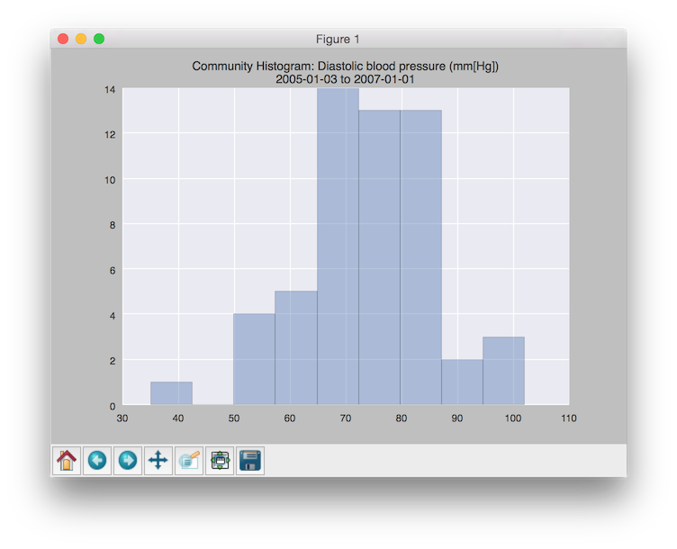
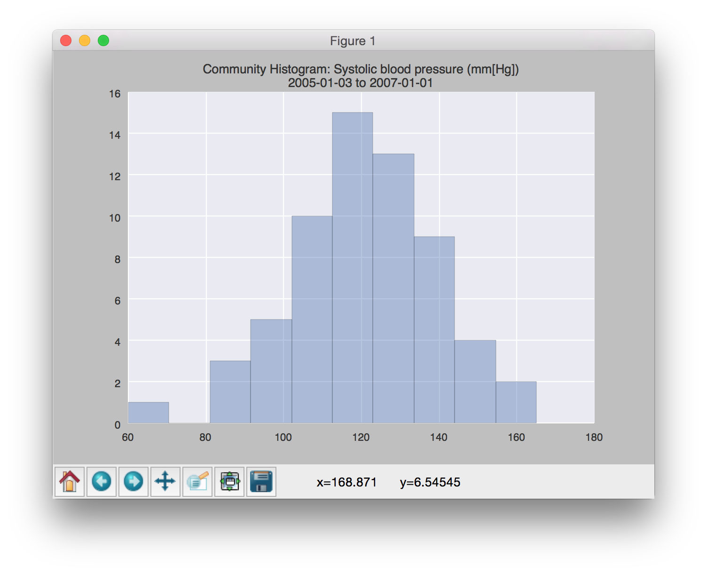

## Introduction

[SMART on FHIR](http://docs.smarthealthit.org) is an initiative to create open-standard APIs (SMART) on open-standard data-formats (FHIR).

I provide some high-level notes on SMART/FHIR usage as well as a project that hits the public sandbox and plots aggregate patient-data.

### Notes

#### Overview 

Overview of the FHIR API:

    http://fhir.cerner.com/dstu1


#### Resource-types

There are a number of FHIR resource-types/nouns that can be queried. For example, the following are the URLs to the SMART for FHIR sandbox for three different nouns for a particular patient:

```
$ curl -s "https://fhir-open-api.smarthealthit.org/Immunization/_search?subject%3APatient=1288992" -H 'Accept: application/json'
$ curl -s "https://fhir-open-api.smarthealthit.org/Encounter/_search?subject%3APatient=1288992" -H 'Accept: application/json'
$ curl -s "https://fhir-open-api.smarthealthit.org/Observation/_search?subject%3APatient=1288992" -H 'Accept: application/json'
```

There doesn't appear to be a way to list the resource-types/nouns that have data for a particular patient. Rather, you just much search them all (this is reasonable).


#### Vital signs

Vital-sign measurements are recorded as "Observation" resource-types, and you can filter them by a "LOINC" code. These LOINC codes are passed as the "name" parameter, and are comma-separated. Note that the comma is itself encoded ("%2C"):

```
$ curl -s "https://fhir-open-api.smarthealthit.org/Observation/_search?subject%3APatient=1288992&name=8480-6%2C8462-4%2C8302-2%2C55284-4" -H 'Accept:application/json'
```

The LOINC codes are specified at "http://docs.smarthealthit.org/profiles" under the "LOINC codes for vital signs" heading.


#### Profiles

The various different types of recorded data are referred to as "profiles". A profile is a subset of a resource-type/noun. The various other types of profiles form the majority of the content at http://docs.smarthealthit.org/profiles .


#### List of patients

You can get a list of patients in the sandbox by querying:

    https://fhir-open-api.smarthealthit.org/Patient

Note that this is essentially a resource-type of "Patient" with no other parameters (as opposed to another resource-type that requires a patient as a parameter).


#### Pagination

In a given query, the "link" child may include a "self" child, and, if there is more data, a "next" child. Pagination is automatic, and these links should be used to pull additional data. Do not construct your own URLs for doing this. For more information, see "http://fhir.cerner.com/dstu1".


#### Data availability

For convenience, and as an example, patient 1288992 (Daniel Adams) has data for the following resource-types:

- AllergyIntolerance

  https://fhir-open-api.smarthealthit.org/AllergyIntolerance/_search?subject%3APatient=1288992

- Condition

  https://fhir-open-api.smarthealthit.org/Condition/_search?subject%3APatient=1288992

- Encounter

  https://fhir-open-api.smarthealthit.org/Encounter/_search?subject%3APatient=1288992

- MedicationPrescription

  https://fhir-open-api.smarthealthit.org/MedicationPrescription/_search?subject%3APatient=1288992

- Observation

  https://fhir-open-api.smarthealthit.org/Observation/_search?subject%3APatient=1288992

- Patient

  https://fhir-open-api.smarthealthit.org/Patient/1288992


#### Notes

By default, the data comes down as XML unless you pass the "Accept" header.


### Test project

This [project](https://github.com/dsoprea/SMARTOnFHIRExample) is a simple exercise to read all of the available patients, bin all of their vital-sign readings (an "Observations" resource-type), and then plot a community-aggregate of any of the vital-signs that we have a sufficient volume on a histogram using [Seaborn](http://stanford.edu/~mwaskom/software/seaborn). There's not much data, so this is fine. All of the reads are cached, so subsequent executions are very fast.

This project is both Python 2.7- and Python 3.4-compatible.


#### Requirements

- requests
- numpy
- matplotlib
- seaborn
- pylab

To install the requirements, just run:

```
$ sudo pip install -r requirements.txt
```


#### Process Overview

1. Read the list of patients from the public [SMART on FIHR sandbox server](http://docs.smarthealthit.org/sandbox).
2. For each patient, read all available vitality information using the "observation" resource-type.
3. We bin the data for all vital-signs. We also filter by timestamp at this point rather than in the initial SMART query due to lack of documentation on how to use it and a lack of time to look into it.
4. We also build a catalog of the types of vital-signs and their descriptions as they are encountered.
5. In a second-pass, we render a plot for each vital-sign that we received a minimum number of records for (currently 50). This currently disqualifies everything but the diastolic and systolic blood-pressure readings. All other data is too trivial (even without a date-range filter).
6. We display the type of vital-sign in the title of the plot, as well as the unit of the measurement.


#### Features

- We will display graphs for every type of vital sign that we've received a minimum amount of data for.
- The title of the output graph will indicate the actual date-range and unit of the data found.
- The [Seaborn](http://stanford.edu/~mwaskom/software/seaborn) graph library is used to draw the plots, as in previous assignments. Seaborn provides very attractive representations.
- The patient data, as well as the vital sign readings, are cached locally, by default.


#### Running

```
$ python view_community_metrics.py 
```


#### Screenshots

Community *diastolic* blood-pressure:



Community *systolic* blood-pressure:


